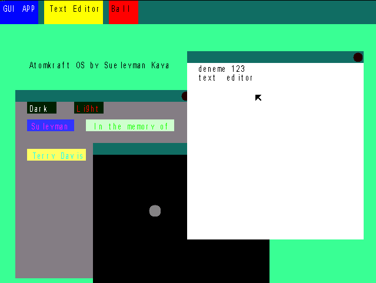

# atomkraft: my first operating system programming experience

## Done:
- 32bits - protected mode [✅]
- Keyboard and mouse interruptions [✅]
- Double bufferring [✅]
- A graphics library to render strings, windows, etc. [✅]
- A task system to implement applications in main.c [✅]
- A parameter system to make development process easy to programmers [✅]

## To-do's:
- FAT file system
- A shell
- Ring buffer
- Multithreading
- Maybe some sounds
